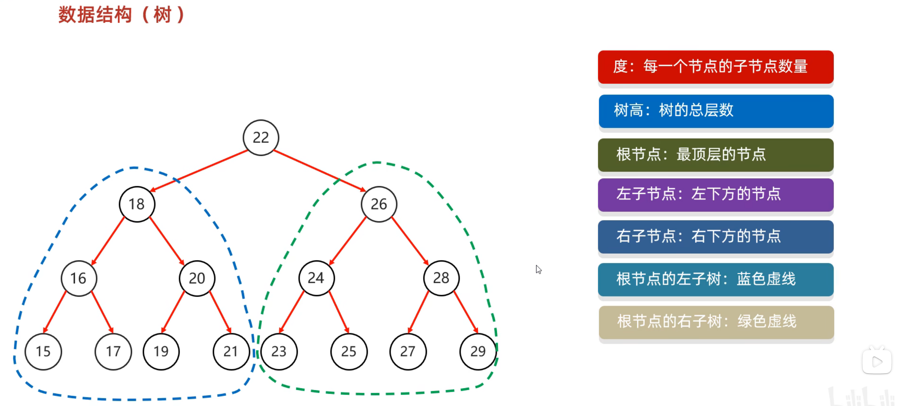

## 数据结构概述
这里数据结构我们主要介绍常见的数据结构。

其实在java里每个常用的数据结构都有配套的方法可以掉用，但是在这里我不仅会把方法写出，也会用自己的代码去表示那些数据结构的实现

我们会依次介绍栈、队列、链表、树、图等数据结构

## 栈
栈：先进后出，后进先出，一端开口

## 队列
队列：先进先出，后进后出，后端进，叫进队；前端出，叫出队

## 数组
数组：查找快，删改慢

## 链表
链表：删改快，查找慢：以对象做节点，每个节点包含数据和下个节点的地址（实现方式，创建一个链表类，包含数据和下个节点地址两个基本元素，然后对象与对象连接起来）

## 树
介绍一个数据结构：树

树有许多节点，每个节点就是一个对象

这个节点对象含有（父节点地址，值，左子节点地址，右子节点地址）

### 1. 二叉树

### 2，二叉查找树

### 3，二叉平衡树

### 4，红黑树***