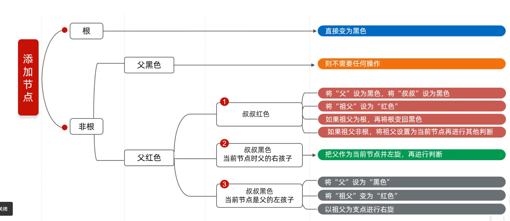

## 数据结构概述
这里数据结构我们主要介绍常见的数据结构。

其实在java里每个常用的数据结构都有配套的方法可以掉用，但是在这里我不仅会把方法写出，也会用自己的代码去表示那些数据结构的实现

我们会依次介绍栈、队列、链表、树、图等数据结构

## 栈
栈：先进后出，后进先出，一端开口

## 队列
队列：先进先出，后进后出，后端进，叫进队；前端出，叫出队

## 数组
数组：查找快，删改慢

## 链表
链表：删改快，查找慢：以对象做节点，每个节点包含数据和下个节点的地址（实现方式，创建一个链表类，包含数据和下个节点地址两个基本元素，然后对象与对象连接起来）

## 树
介绍一个数据结构：树

树有许多节点，每个节点就是一个对象

### 1. 二叉树
二叉树也有节点，每个节点也是一个对象

这个节点对象含有（父节点地址，值，左子节点地址，右子节点地址）

### 2，二叉查找树
二叉查找树是一种特殊的二叉树，它的每个节点都有一个值，且满足以下性质：

1，每个节点上最多有两个子节点

2，左子树的所有节点的值都小于根节点的值

3，右子树的所有节点的值都大于根节点的值

#### 遍历方式
1，前序遍历：先访问根节点，再访问左子树，最后访问右子树
2，中序遍历：先访问左子树，再访问根节点，最后访问右子树
3，后序遍历：先访问左子树，再访问右子树，最后访问根节点

### 3，二叉平衡树
#### 定义
因为二叉查找树存在缺点：可能会让一边子树的层数过长，让整体的效率变低，所以出现了平衡二叉树

二叉平衡树是一种特殊的二叉查找树，它的每个节点的左子树和右子树的高度差至多为1。

#### 左旋和右旋
让二叉树保持平衡的方式有两种：左旋和右旋。

左旋步骤：

1，从添加的结点开始，往父节点找，当左右子树层数差大于1的节点作支点

2，把支点左旋降级，变成左子节点

3，支点的右子节点上升

4，若支点的右子节点上有左子节点，那就让这个左子节点连到降级后的支点的右子节点上。

**右旋的步骤一致，只不过方向相反而已**

#### 特别的旋转应对
下面这几种添加方式对应了不同的旋转操作

1，左左：在根节点左子树上的左子树上添加节点->作一次右旋

2，左右：在根节点左子树上的右子树上添加节点->先做局部左旋，再作整体右旋

3，右左：在根节点右子树上的左子树上添加节点->先做局部右旋，再作整体左旋

4，右右：在根节点右子树上的右子树上添加节点->作一次左旋

### 4，红黑树***
#### 定义
是一种特殊的二叉查找树，它可以通过红黑规则来做一定的平衡。

它的节点对象上多了一个颜色属性

基本规则

① 每一个节点或是红色的，或者是黑色的

② 根节点必须是黑色

③ 如果一个节点没有子节点或者父节点，则该节点相应的指针属性值为 Nil，这些 Nil 视为叶节点，每个叶节点 (Nil) 是黑色的

④ 如果某一个节点是红色，那么它的子节点必须是黑色 (不能出现两个红色节点相连的情况)

⑤ 对每一个节点，从该节点到其所有后代叶节点的简单路径上，均包含相同数目的黑色节点；

#### 插入节点
我们总结上面的规则，做出来的应对不同添加情况所做的步骤如下

**注意：对于添加节点非根，并且父节点是红色，叔叔节点是黑色的两种情况，（即图中绿色和灰色操作块的内容）这张图只展示了父节点在祖父节点左边的情况，其实还应该分类一个父亲节点在祖父节点右边的情况，步骤是一致的，只不过旋转方向反过来**
