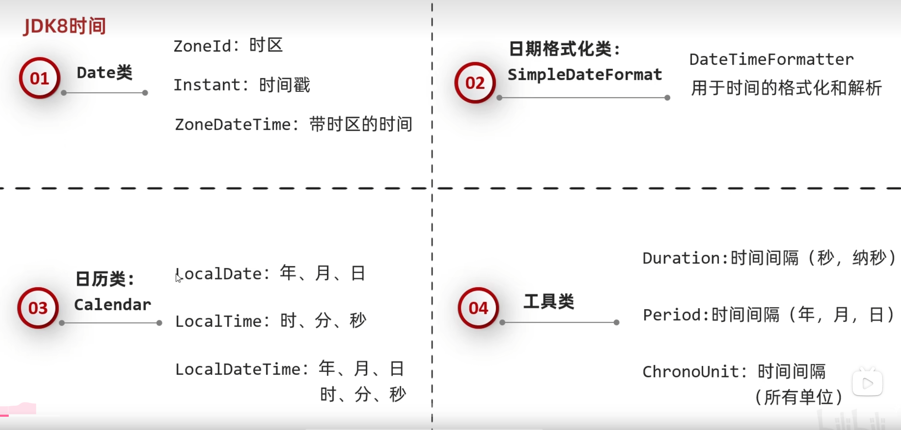
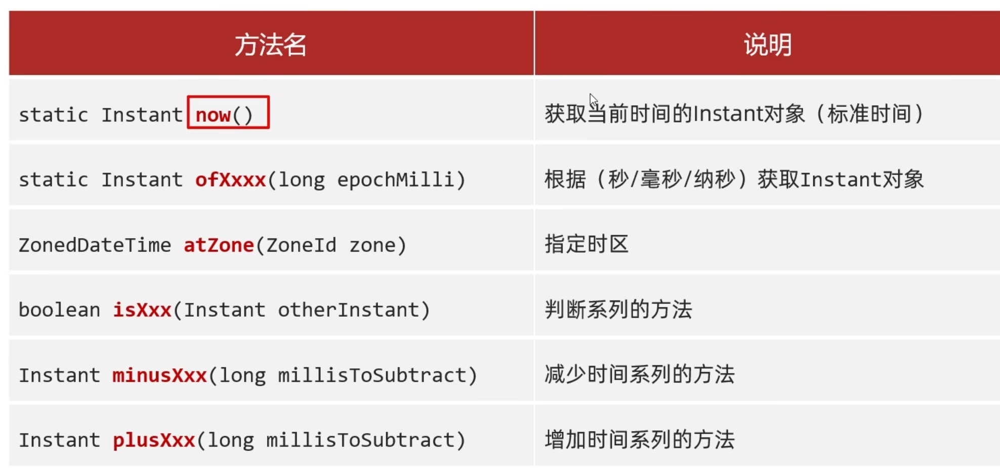
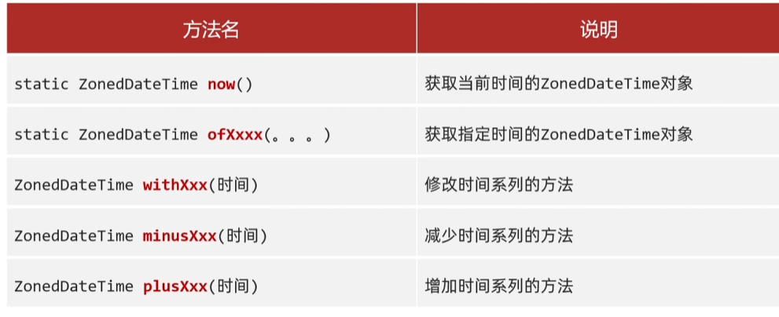

## 前提
在开始之前我们先列出时间的相关单位英文单词


|秒|second|
|-|-|
|毫秒|milli|
|纳秒|nano|

**（小tips：后面的jdk8新增的时间类对象的改变不会对原对象做改动，而是创建新的对象,所以他的返回值都是这个类对象）**


## 时间类（Date类和SimpleDateFormat类，主要于jdk8之前使用）

### 1. Date类
Date类是java中用于表示日期和时间的类，它提供了一些基本的方法来操作日期和时间。

Date类的构造方法有以下几个：

```java
Date date = new Date();//创建一个Date对象，表示当前时间
Date date2 = new Date(1694524800000L);//创建一个Date对象，表示1694524800000毫秒的时间点

```

当然也存在更改时间的方法，获取时间的方法，比如：

```java
public void setTime(long date)
public long getTime()
```

### 2. SimpleDateFormat类
对于时间，光用date类的话很难看得懂，所以有一个类可以帮我们格式化时间。

simpleDateFormat类（API同名搜索）

作用：

1，格式化：能把时间变成熟悉的格式

2，解析：能把字符串表示的时间转换成Date对象，以便计算

具体的使用方法如下：

```java
          
        SimpleDateFormat sdf=new SimpleDateFormat("yyyy-MM-dd EE");
        Date date1=new Date();//默认创建当前的系统时间
        String str1=sdf.format(date1);//格式化时间，把Date对象转换成字符串表示
        System.out.println(str1);


        //一个小练习，把2000-11-11转换成2000年11月11日
        // 解析时间
        //把一个已经知道的时间的字符串转换成Date对象
        String str2="2000-11-11";
        SimpleDateFormat sdf2=new SimpleDateFormat("yyyy-MM-dd");//如果是想把字符串转成simpledateformat形式，在定义对象的时候，这个分时一定要和字符串的日期模式完全一致
        Date date2=sdf2.parse(str2);// 解析成Date对象
        System.out.println(date2);
        // 格式化时间
        //把一个已经知道的时间的Date对象转换成字符串表示  
        SimpleDateFormat sdf3=new SimpleDateFormat("yyyy年MM月dd日");
        String str3=sdf3.format(date2);
        System.out.println(str3);
```

### 3. Calendar类
Calender（API同名搜索）

一个日历类，也是一个抽象类，它本质是一个数组，创建对象不直接new，而是调用一个静态子方法 getInstance()

、、、java
static Calendar getInstance()
          //使用默认时区和语言环境获得一个日历。
、、、

存在小细节：

1，它的月份表示在0-11，所以在获取到月份数据以后需要+1处理

2，它的星期的习惯是按西方的，星期日才是它的第一天即七个数值1，2，3...7分别对应星期日，星期一，星期二.....星期六

总的来说calendar是一个日历类，它倾向于表达和记录一个大的完整的日期，并且有方便的方法对里面的元素做更改。

使用示例：

```java
        Date d1=new Date(0L);//创建一个Date对象，表示1970年1月1日0时0分0秒的时间点
        Calendar c1=Calendar.getInstance();//创建一个Calendar对象，表示当前系统时间
        System.out.println(c1);
        c1.setTime(d1);//更改c1的时间表示为d1的时间表示
        System.out.println(c1);
```


## 时间类（jdk8之后）

在jdk8之后，java使用了更好的时间表达体系，他整体是前面几个类的延续和优化，对应图如下：



### 1. ZoneId 类
ZoneId类是java中用于表示时区的类，它提供了一些基本的方法来操作时区,比如：
```java
        //获取所有的时区
        Set<String> a= ZoneId.getAvailableZoneIds();
        System.out.println(a);

        //获取系统的默认时区
        ZoneId zoneId1= ZoneId.systemDefault();
        System.out.println(zoneId1);

        //自定义时区
        ZoneId zoneId2= ZoneId.of("Asia/Chongqing");
        System.out.println(zoneId2);
```

### 2.instant 类
instant类,时间戳，是java中用于表示时间点的类，它提供了一些基本的方法来操作时间点

（API查询不到，这里做补充）

常用方法名


|方法名|作用|
|-|-|
|static Instant now()|获取当前的instant对象|
|static Instant ofxxxx(long epochMilli)|根据传入参数的时间获取对象|
|ZonedDateTime atZone(ZoneId zone)|指定一个时区|
|boolean isxxx(Instant oyherInstant)|判断系列的方法|
|Instant minusxxx(long millisToSubtract)|减少系列时间的方法|
|Instant plusxxx(long millisToSubtract)|增加系列时间的方法|




### 3. ZonedDateTime 类
也是表示时间的类，它表示的是带时区的类

常用方法

|方法名|作用|
|-|-|
|static ZoneDateTime now()|获取当前的时间的ZoneDateTime对象（带系统默认时区）|
|static ZoneDateTime ofxxx(时间)|设定时间的ZoneDateTime对象，带时区|
|ZoneDateTime withxxx(时间)|修改时间系列的方法|
|ZoneDateTime minusxxx(时间)|减少时间系列的方法|
|ZoneDateTime plusxxx(时间)|增加时间系列的方法|



### 4. DateTimeFormatter
在jdk8以后有一个更方便的类DateTimeFormatter,其格式使用的和simpleDateFormat一样

DateTimeFormatter的方法
```java
static DateTimeFormatter ofParttern(格式)//设定格式
String format(时间对象)//按指定方式格式化
```


在使用时，需要先设定格式，再按格式格式化时间对象。

所以这里有个在jdk8以后的时间的获取方式，让DateTimeFormatter和instant配套使用

static Instant now()//获取当前的instant对象

ZoneId.of("Asia/Shanghai")//获得一个时区对象

ZonedDateTime atZone(ZoneId zone)//指定一个时区
```java
ZonedDateTime z3= Instant.now().atZone(ZoneId.of("Asia/Shanghai"));
        System.out.println(z3);

```


### 5. LocalDate,LocalTime,LocalDateTime类
与calendar日历类对应的，jdk8以后的时间类

LocalDate：年月日

LocalTime：时分秒

LocalDateTime：年月日时分秒

都有较为统一的方法

|方法名|作用|
|-|-|
|now（）|获得当前的时间|
|ofxxx（）|设定对应系列时间的值|
|getxxx()|获得对应系列时间的值|
|withxxx（）|修改对应系列时间的值|
|minusxxx（）|减少对应系列时间的值|
|plusxxx（）|增加对应系列时间的值|


### 6. Duration,Period,Instant类\
jdk8的时间类有几个好用的工具类

Duration （秒，纳秒）

Period（年月日）

ChronoUnit（最常用，覆盖所有单位）

单列ChronoUnit
通过这个类，调用方法

**ChronoUnit.时间系列.between(前者时间对象，后者时间对象)**

可返回一个长整型，对应中间时间系列的差值

一个例子：
```java
        LocalDate now = LocalDate.now();
        LocalDate settingTime = now.plusDays(1);
        settingTime=settingTime.plusYears(3);
        settingTime=settingTime.plusMonths(2);


        //period，做年月日的时间比较，但其实本质意思是持续时间，刚好有这个比较时间的作用
        Period period = Period.between(now,settingTime );//意义是后者时间减去前者时间
        System.out.println(period.getYears());//3
        System.out.println(period.getMonths());//2
        System.out.println(period.getDays());//1

        System.out.println("=======================================");

        LocalTime now1 = LocalTime.now();
        LocalTime settingTime1=now1.plusHours(1);
        settingTime1=settingTime1.plusMinutes(1);
        settingTime1=settingTime1.plusSeconds(1);
        settingTime1=settingTime1.plusNanos(1);

        //Duration,适合做分秒的时间的比较，但其实本质意思是持续时间，刚好有这个比较时间的作用
        Duration duration = Duration.between(now1,settingTime1);//也是后者减前者
        System.out.println(duration.toDays());
        System.out.println(duration.toHours());
        System.out.println(duration.toMinutes());
        System.out.println(duration.toSeconds());
        System.out.println(duration.toMillis());
        System.out.println(duration.toNanos());

        System.out.println("=======================================");

        LocalDateTime now2 = LocalDateTime.now();
        LocalDateTime settingTime2 = LocalDateTime.of(2024,1,1,1,1,1,1);
        //ChronoUnit
        //真正常用的来获取时间差值的类
        long zzz= ChronoUnit.DAYS.between(settingTime2,now2);//后者减前者
        System.out.println(zzz);
        System.out.println(ChronoUnit.DAYS.between(settingTime2,now2));
        System.out.println(ChronoUnit.YEARS.between(settingTime2,now2));
        System.out.println(ChronoUnit.MONTHS.between(settingTime2,now2));
        System.out.println(ChronoUnit.SECONDS.between(settingTime2,now2));
        System.out.println(ChronoUnit.HOURS.between(settingTime2,now2));
        System.out.println(ChronoUnit.MINUTES.between(settingTime2,now2));
        System.out.println(ChronoUnit.MILLIS.between(settingTime2,now2));
        System.out.println(ChronoUnit.NANOS.between(settingTime2,now2));
```


