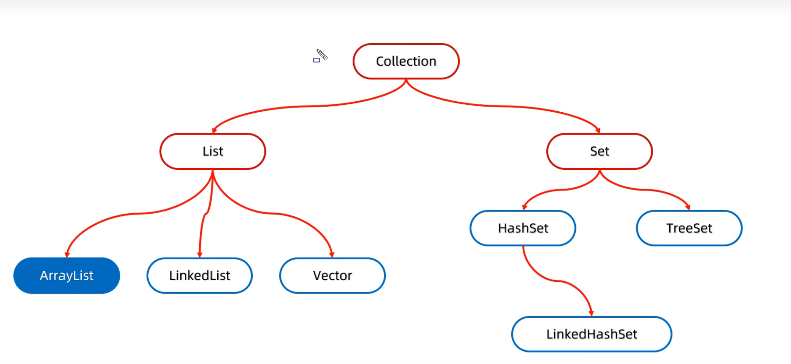
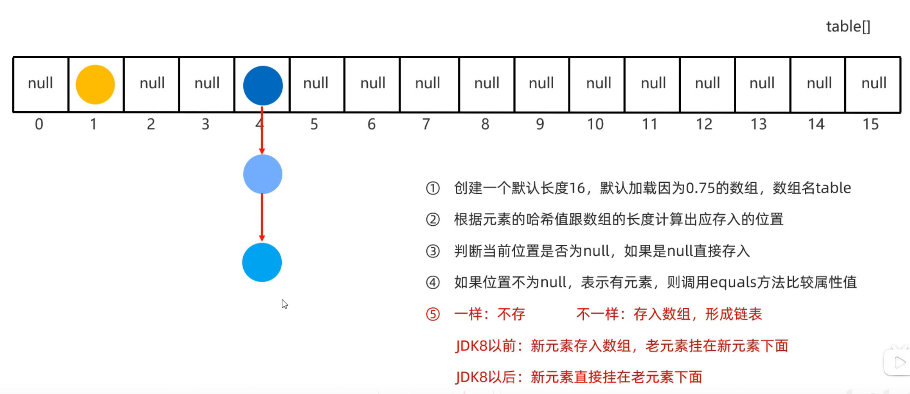
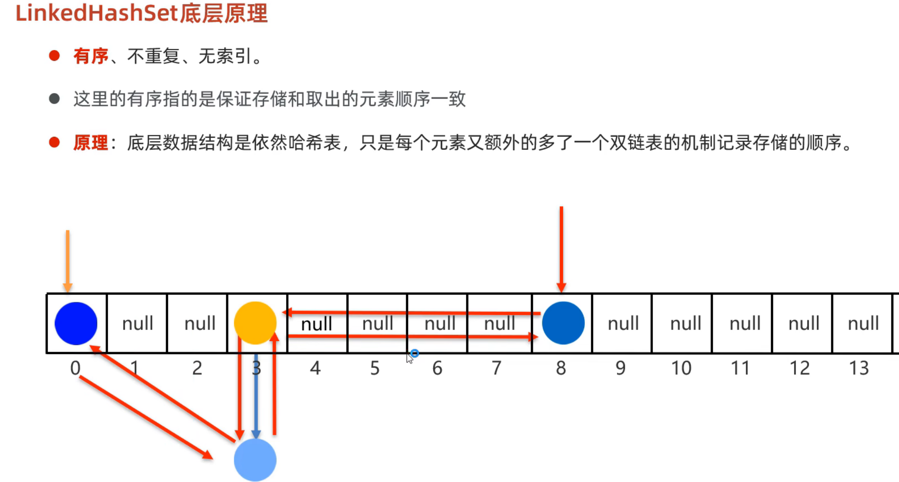

## 集合概述
首先，在java里，集合分两大派系，单列集合（collection）和双列集合（map）

单列集合主要包括List、Set、Queue

双列集合主要包括Map、Set

## 单列集合（collection）


可以看到，主要有List、set分布，总的来说他们有以下特征：

List：有序，可重复

Set：无序，不可重复

我们从collection开始
### 1，Collection

#### Collection的基础
Collection是java里最基础的集合，所有的集合都继承自Collection接口，所有集合的实现类都实现了Collection接口。

Collection接口定义了集合的基本操作，包括添加、删除、判断、清空等。

#### 通用方法

|方法名称|说明|
|--|--|
|public boolean add(E e)|把给定的对象添加到当前集合中|
|public void clear()|清空集合中所有的元素|
|public boolean remove(E e)|把给定的对象在当前集合中删除|
|public boolean contains(Object obj)|判断当前集合中是否包含给定的对象|
|public boolean isEmpty()|判断当前集合是否为空|
|public int size()|返回集合中元素的个数/集合的长度|

#### 特别说明
1，add小细节：添加返回值，对于list而言，是允许插入的，永远返回true；对于set而言，由于set不允许重复，若添加的重复元素会不成功，返回false

2，remove小细节：由于Collection定义共性的方法，所以不能通过索引来删除数据，只能用元素的对象。remove也有返回值，成功删除返回true，反之false

3，contains小细节，当我们要用自己写的类存在集合里面的话，想用contains，必须要在类内实现equals的重写。因为contains的底层有用到equals

#### 关于collection的遍历方式（这里讨论通用的，即list和set都可以用的）
##### 1，迭代器
迭代器（Iterator类）

###### 构造
Iterator<E> 迭代器名称=集合名.Iterator();//意为创建一个这个集合的一个迭代器指针，默认指向0

```java
构造：Iterator<E> 迭代器名称=集合名.Iterator();//意为创建一个这个集合的一个迭代器指针，默认指向0
```

###### 常用方法
|方法名称|说明|
|--|--|
|boolean hasNext()|hasnext（）检测是否还有元素在集合内，是返回true，否返回false|
|E next()|next（）返回当前的元素并使迭代器后移|
|void remove()|remove()移除迭代器当前指向的元素| 

###### 代码
```java
//遍历方式的写法
Iterator<Integer> i = arr.iterator();  
while (i.hasNext()) {
System.out.println(i.next());
}
```

###### 小细节
- 报错 NoSuchElementException（在指针已经指向没有元素的位置时仍调用next（）就会报这个错）
- 迭代器遍历完毕，指针不会复位，想重新遍历的话，只能再次创建一个迭代器
- 迭代器遍历时，不能用集合的方法进行增加或者删除，但可以用迭代器的方法，remove（）删除当前元素，但没有添加方式

##### 2，增强for循环

格式：for(数据类型 参数名：数组或集合名)
```java
//遍历方式的写法
for (Integer i : arr) {
System.out.println(i);
}
```
其实这个方法很通用基本的数组，集合都可以用

##### 3，Lambda表达式遍历（forEach方法）
本质是使用forEach方法

forEach(Consumer<>)他的参数列表是一个接口，要传输一个接口的实现类，也就可以使用匿名内部类的格式，重写里面的accept方法

###### 示例代码
```java
//遍历方式的写法
arr.forEach(new Consumer<Integer>() {//匿名类的写法，重写accept方法
@Override
public void accept(Integer A) {//这里传递的相当于增强for里的那个参数名，与数组的元素对应
System.out.println(A);
}
});
```
转换成lambda的格式

```java
arr.forEach(integer -> {System.out.println(integer);});
```

### 2，List
List是有序的可重复的集合，常用实现类有ArrayList、LinkedList、Vector等。

#### List方法
对应上面那个图，它继承于Collection接口，所以能用collection的方法，此外它也有一些独特的方法，总的来说对应，增，删，改，查。

|方法名称|说明|
|--|--|
|void add(int index,E element)	|在此集合中的指定位置插入指定的元素|
|E remove(int index)	|删除指定索引处的元素，返回被删除的元素|
|E remove(int index)	|删除指定索引处的元素，返回被删除的元素|
|E set(int index,E element)	|修改指定索引处的元素，返回被修改的元素|
|E get(int index)	|返回指定索引处的元素|

#### 小细节
- remove（），我们注意到，这里有remove的重载，而在调用的时候，会优先调用参数数据类型一致的方法。
- 所以这里如果是integer类型的集合，使用remove（1）；的话，他是删除1索引上的元素。
- 如果想删除指定元素的话，要手动装箱Integer i=integer.valueOf(1),才能删除“1”这个数字

#### List遍历方式
使用列表迭代器ListIterator（）

```java
ListIterator<Integer> listIterator = list.listIterator();
while (listIterator.hasNext()) {
System.out.println(listIterator.next());
}
```

基础的使用方式和正常迭代器的方式基本一样，但是它允许在遍历的时候用add和remove方法对集合作改动，具体可搜索API：**ListIterator**查找方法


### ArrayList的底层实现
这个集合是我们最先接触的集合之一，目前无需了解多的方法，基础的从collection以及List继承的方法就够用了

这里简单说明一下ArrayList的底层实现

他的本质是一个**数组**，在初始创建的时候会创建一个容量为10的数组，每次超界就扩大1.5倍，然后放进元素

### LinkedList的底层实现
本质是一个**双链表**，每次创建的节点对象会有头地址，尾地址，数据层三部分，每次创建会排列好里面的节点关系。正因为它是链表，有头尾索引查找的独特方法（做了解，用的少）
#### 方法
| 特有方法 | 说明 |
| ---- | ---- |
| public void addFirst(E e) | 在该列表开头插入指定的元素 |
| public void addLast(E e) | 将指定的元素追加到此列表的末尾 |
| public E getFirst() | 返回此列表中的第一个元素 |
| public E getLast() | 返回此列表中的最后一个元素 |
| public E removeFirst() | 从此列表中删除并返回第一个元素 |
| public E removeLast() | 从此列表中删除并返回最后一个元素 |


### 3，Set
#### Set介绍
Set是一个无序的不可重复的集合，常用实现类有HashSet、TreeSet等。

它没有额外的方法，常用的都继承于collection

遍历方式

-1，迭代器（Iterator）
```java
Iterator<Integer> iterator = set.iterator();
while (iterator.hasNext()) {
System.out.println(iterator.next());
}
```
-2，增强for
```java
for (Integer i : set) {
System.out.println(i);
}
```

-3，Lambda（forEach）
```java
set.forEach(integer -> {System.out.println(integer);});
```

**因为下面的实现类继承于set，所以Hashset，linkedHashSet，treeSet都能用这三种遍历方式**

### HashSet（无序，不重复，无索引）
#### HashSet介绍
set集合的实现方法之一

无额外方法，这里讲讲底层

-它底层上用**哈希表**存数据，而哈希表是数组+链表+红黑树
-哈希表里有一重要的东西：**哈希值**
-哈希值是对象的整数表达形式，通过哈希值才能确定元素在哈希表的位置

#### 哈希值
- 根据 hashCode 方法算出来的 int 类型的整数
- 该方法定义在 Object 类中，所有对象都可以调用，默认使用地址值进行计算
- 一般情况下，会重写 hashCode 方法，利用对象内部的属性值计算哈希值

#### 对象的哈希值特点
- 如果没有重写 hashCode 方法，不同对象计算出的哈希值是不同的
- 如果已经重写 hashcode 方法，不同的对象只要属性值相同，计算出的哈希值就是一样的
- 在小部分情况下，不同的属性值或者不同的地址值计算出来的哈希值也有可能一样。（哈希碰撞）
- **HashSet插入数据的位置是根据”index=（数组长度-1）&哈希值“计算的**

#### HashSet插入数据的方式

- ① 创建一个默认长度 16，默认加载因为 0.75 的数组，数组名 table
- ② 根据元素的哈希值跟数组的长度计算出应存入的位置
- ③ 判断当前位置是否为 null，如果是 null 直接存入
- ④ 如果位置不为 null，表示有元素，则调用 equals 方法比较属性值
- ⑤ 一样：不存  不一样：存入数组，形成链表

- JDK8 以前：新元素存入数组，老元素挂在新元素下面
- JDK8 以后：新元素直接挂在老元素下面，另外，当链表长度超过8，而且数组长度大于等于64的时候，这个链表自动转为红黑树

#### 遍历
他会从数据的0索引开始，一条链表一条链表的去遍历元素，和插入的顺序不一样，所以无序

#### 总结
**总的来说，HashSet是一个在数组里放链表的一种数据结构，并且在数据多了以后还会改用红黑树来存储。**

### LinkedHashSet（有序，不重复，无索引）
#### LinkedHashSet介绍
- 无新方法，使用collection继承方法
- 它同样也是哈希表：数组里存链表，但是是在每个添加的元素上多了个双链表机制，前后两个元素可以相互记录，用以遍历，因此有序

具体如图



### TreeSet
#### TreeSet介绍
- 特点：不重复，无索引，可排序：默认从小到大
- 它的底层是基于红黑树的结构实现排序的

#### 排序规则
- 1，对于数值类型，都是从小到大的默认升值排序
- 2，对于字符，字符串类型，是按照字符在ASCII码表中的数字升序排序。而字符串这种不只一个字符的，他会从第一个字符开始比，如果一样就往后找一个看，直到有任何一次能比出区别，就不再看了，所以它与长度无关
- 3，如果我们使用自定义类型，那就需要设定比较规则，这有两种方式
##### （1）在对应得javabean类实现comparabel接口来制定比较规则
在类后引用Comparator接口，重写compare方法，制定比较规则。

例子代码
```java


public class Student implements Comparable<Student>{
    //成员内容省略
    ......

    @Override
    public int compareTo(Student o) {
        //首先我们要知道，treeset的排序是依靠红黑树实现的，这个方法就是内部做红黑树排序时会调用的比大小方法
        //this是当前要插入的元素，o是原来就存在的数，这里表示按年龄升序排
        //3. 方法返回值的特点
        //- 负数：表示当前要添加的元素是小的，存左边
        //- 正数：表示当前要添加的元素是大的，存右边
        //- 0 : 表示当前要添加的元素已经存在，舍弃
        return this.getAge()-o.getAge();
    }
}

```
这种在类内写好以后会自动调用，测试类里正常的创建对象，添加元素，再打印就会以有序的形式打印出来
##### （2）创建TreeSet对象的时候，传递比较器Comparator制定规则（优先级更高）
- TreeSet(Comparator<? super E> comparator) 
- 直接在参数里写一个匿名类，制定比较规则
- 我们一般都用第一种比较规则就好，但是有的时候第一个规则用不了，我们才用第二种，比如对于string类型，我想让他优先字符串长度排序，而非默认的排序，那就用第二种去制定新的排序规则，例如下面这个例子
```java
TreeSet<String> Sset2=new TreeSet<>(new Comparator<String>() {
            //o1：表示要添加的元素
            //o2：表示在红黑树存在的元素
            @Override
            public int compare(String o1, String o2) {
                int i=o1.length()-o2.length();//优先比长度
                if(i==0){
                    i=o1.compareTo(o2);//长度一致再比ARCII码
                }
                return i;
            }
        });
        Sset2.add("yi");
        Sset2.add("abd");
        Sset2.add("abc");
        Sset2.add("abde");

        System.out.println(Sset2);
```
### （总结）单列集合各个实现类的应用场景
#### 1. 如果想要集合中的元素可重复
用 **ArrayList** 集合，基于数组的。（用的最多）

#### 2. 如果想要集合中的元素可重复，而且当前的增删操作明显多于查询
用 **LinkedList** 集合，基于链表的。

#### 3. 如果想对集合中的元素去重
用 **HashSet** 集合，基于哈希表的。（用的最多）

#### 4. 如果想对集合中的元素去重，而且保证存取顺序
用 **LinkedHashSet** 集合，基于哈希表和双链表，效率低于 HashSet。

#### 5. 如果想对集合中的元素进行排序
用 **TreeSet** 集合，基于红黑树。后续也可以用 List 集合实现排序。


## 泛型
### 泛型的说明
基本说明：他就是限定一个方法，类的数据类型的一个“看门打大爷”，如果没有他的话，代码会很难管理，例如Arraylist的使用，没有它的话，在遍历元素的时候没法直接使用那些元素的方法。

之所以把他放进集合的文章里，是因为它最常用于集合相关的时候

**用处：用在我们不确定形参的数据类型的时候**

**基本格式<数据类型>**

总的来说我们会用在三个地方形成三种泛型：**泛型类，泛型方法，泛型接口**

### 泛型类
用在类后面，形成泛型类

格式

**修饰词 class 类名<数据类型>(数据类型 形参){......}**

这种用法能让类内的方法都使用泛型擦参数

### 泛型方法
用在方法前面，形成泛型方法

格式：

**修饰词 <数据类型> 返回类型 方法名（数据类型 形参）{......}**

这种方法仅在方法内可用，适合那种只有这个方法不确定参数数据类型的时候

### 泛型接口
用在接口后面。形成泛型接口

格式

**修饰符 interface 接口名<数据类型> {......}**

**但是对泛型接口做实现比较特别，有下面的两种实现方式：**

#### 1，实现类给出具体类型
在类内引用泛型接口的时候，在接口后面直接确定

例如
```java
public class MyArrayList2 implements List<String> {.......}
```

#### 2，实现类不给出具体类型
实现类延续泛型，在创建对象的时候再确定

在实现类依然原样的继承接口，创建对象时在确定就行

例如
```java
public class MyArrayList2 implements List<E> {
@Override
public boolean add(E e){....}
....
}
//创建对象
 MyArrayList2<String> A=new  MyArrayList2<>()
//此时，这个数据类型就会被确定为String
```

### 泛型通配符
有的时候我们使用泛型，虽然不知道具体会传递什么数据类型，但是我想限定传输的数据类型在某一范围，这是可以用泛型的通配符

泛型的通配符：？

具体格式：
|通配符|意义|
|------|------|
|<? extends E> |表示可以传递E或者E的所有子类类型|
|<? super E > |表示可以传递E或者E的所有父类类型|

值得一提的是，泛型的通配符只能用在变量或者方法的形参上，不能写在类、方法的泛型定义上
例如
```java
package mydo_levelup.generics;

import java.util.ArrayList;

public class Test {
    public static void main(String[] args) {
        HashiDog hashiDog=new HashiDog("六六",3);
        BosiCat bosiCat=new BosiCat("波斯",2);
        TaitiDog taitiDog=new TaitiDog("道王",4);
        LihuaCat lihuaCat=new LihuaCat("彪哥",3);
        ArrayList<Cat> catArrayList=new ArrayList<>();
        catArrayList.add(bosiCat);
        catArrayList.add(lihuaCat);
        ArrayList<Dog> dogArrayList=new ArrayList<>();
        dogArrayList.add(hashiDog);
        dogArrayList.add(taitiDog);
        ArrayList<Animal> animalArrayList=new ArrayList<>();
        animalArrayList.addAll(dogArrayList);
        animalArrayList.addAll(catArrayList);

        keepAnimal(animalArrayList);//允许传递Animal或者Animal的所有子类类型
        System.out.println("============================");
        keepCat(catArrayList);//允许传递Cat或者Cat的所有子类类型
        System.out.println("============================");
        keepDog(dogArrayList);//允许传递Dog或者Dog的所有子类类型
    }

    public static void keepDog(ArrayList<? extends Dog> list){//这里使用泛型通配符，表示可以传递Dog或者Dog的所有子类类型，但是不能传递其他类型，同时只用在形参上，而且去掉了方法上的泛型定义
        for (Dog e : list) {
            System.out.println("人喂了狗");
            e.eating();
        }
    }

    public static void keepCat(ArrayList<? extends Cat> list){
        for (Cat e : list) {
            System.out.println("人喂了猫");
            e.eating();
        }
    }

    public static void keepAnimal(ArrayList<? extends Animal> list){
        for (Animal e : list) {
            System.out.println("人喂了动物");
            e.eating();
        }
    }

}

```


### 泛型没有继承性，但是数据有继承性：
泛型容器本身不具备继承关系；但是容器里面存放的对象，仍然保留正常的继承关系

即传递的容器的数据类型一定要与参数设定一致，而在容器里存的元素可以接受继承，例如
```java
//Animal是Dog的父类
ArrayList<Animal> A=new ArrayList<Animal>();
Dog D=new Dog();
A.add(D);//这是允许的
//但是对于
public void method(ArrayList<Animal> List){.......}
//我去传入一个Dog的集合List是不允许的
ArrayList<Dog> DA=new ArrayList<Dog>();
method(DA);//会报错
```