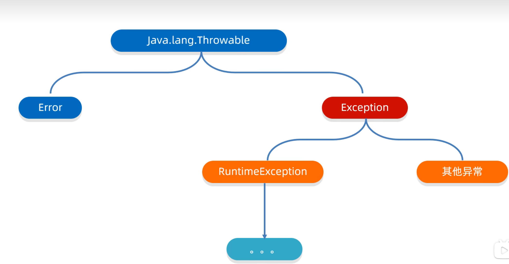

## 书写的格式规范
-bin     用于存放各种工具命令
-conf      存放相关配置文件
-include  存放一些平台特定的头文件
-jmods    存放各种模块
-legal      存放各个模块的授权文档
-lib          存放了工具的一些补充jar包
 

## IDEA小技巧
批量修改变量（同名变量统一修改）：选中变量以后shift+f6

## String 数据类型的存储方式：
string有两种初始化方式，
1，直接等号赋值，这种情况虚拟机会尝试复用即，a=“abc”和b=“abc”，在内存上用的是同一块堆空间，
2，用char数组或者byte数组拼接创建的string变量，会新开辟堆内存空间，不会说尝试复用
总得来说，可以把string看做是一个类，他的变量就是他的数组，实际存储空间在堆内存里，变量存的都是地址
正因为本质是地址，所以不能单纯的用==来比对字符串（或者说不能用这个方式比对所有的引用类型数据），在string里，应该使用equals（）（区分大小写），或者equalslgnoreCase（）（不区分大小写）。

## System的arraycopy方法，实现数组的复制
System.arraycopy(Object src, int srcPos, Object dest, int destPos, int length)
src：来源数组  

srcPos：来源数组起始索引 

dest：目标数组

destPos：目标数组起始索引  

length：复制长度

特别的，当两个数组都是基础数据类型的时候，他们的数据类型必须一致

特别的，当两个数组都是引用数据类型的时候，子类可以复制给父类

## 重写toString（）
当我们想要打印，或者获取对象的属性时，可以重写toString（）

## 重写equals（）方法
equals方法，一般拿来比较，如果没有对它进行重写，那他调用的是Object中的方法，这是对地址值作比较
我们一般会重写让他能对我们想要的对象进行比较。
在IDEA里。通过ALT+INSERT快捷键可以选择生成，选择里面的equals（）即可

## clone()克隆方法，让对象能完整的克隆到一个新的对象上面
clone()克隆方法，让对象能完整的克隆到一个新的对象上面
书写方式，

1，重写clone方法（因为clone本身是protect方法，所以要重写）

2，对应的Javabean类要实现Cloneable接口

3，创建对象并调用clone赋值给新的对象（要记得强转）

补充：存在浅克隆和深克隆

浅克隆：遇到基础数据类型直接传值，引用数据类型直接传地址，因此引用数据类型用的是同一个东西，会因别的改动而发生数据污染

深克隆：遇到基础数据类型直接传值，引用数据类型是创建新的空间地址去把原数据写进去，形成数据隔离。（但是字符串不会，因为串池复用的关系）

具体实现是需要自己重写的，没有现成的

但其实可以通过第三方工具，有些人会开发这种小工具，我们可以从网上下载，放进项目里使用我。

格式上，我们一般把第三方工具放进lib文件包里，放完以后，还要右键工具，选add at library（添加为库）才算真正加进项目里。

## Biginteger类型
可以存放大的整形具体的使用
1，若数字没有超出longint的范围，可以采用静态方法valueof创建

2，若超出则可以采用构造方法获取，具体传入字符串

3，其对象创建后不可改变

4，凡是经过数学运算后都会产生一个新的biginteger对象

5，在0~16有数据优化，会复用，地址是一样的


## Bigdecimal类型
与上面的相反，是用来存有多位小数的类型

1，一般在数超出double的表示范围时会去使用他，并且用的是构造方式创建，传入字符串的那种

2，他在0~10之间有数据优化，会复用，地址是一样的

还有对应的舍入方式，具体的API去查Roundingmods

## 正则表达式，（API搜索pattern）
具体详细找正则表达式的使用文章https://firefly-9vy.pages.dev/posts/javapatternabout/

用处：

1，验证字符串是否符合要求

2，查找想要的字符串类型

正则的书写，如果想要把两位及以上作为一个整体可以用（）

比如我希望正则匹配一个从01到85的数，
那分析下来就是，第一位是0到7时，第二位可以是0到9，
而当第一位是8时，第二只能时0到5，
那么"([0-7]//d|[8][0-5])"是可行的，
可以理解为，（）内会单独计算有几个数，中间用|(或)隔开，可以实现该功能

## 时间类
包括Date、Calendar、SimpleDateFormat等（jdk8之前使用）
以及与之对应的ZoneId 类Instant 类ZoneDateTime类

LocalDate：年月日

LocalTime：时分秒

LocalDateTime：年月日时分秒

Duration （秒，纳秒）

Period（年月日）

ChronoUnit（最常用，覆盖所有单位）

等等，具体在这篇文章里有详细的介绍
https://firefly-9vy.pages.dev/posts/javadateclass/


## 包装类
包装类：
在java里，一切皆对象，很多时候，java的很多API、集合都只能传入对象，所以给所有基础数据类新都写了一个包装类

//只有int和char比较特殊，其他全都是首字母大写
|基础数据类型|包装类|
|-|-|
|int|Integer|
|char|Character|
|byte|Byte|
|short|Short|
|long|Long|
|float|Float|
|double|Double|
|boolean|Boolean|

在jdk5以前，需要new或者调用方法来创建对应的包装类，而且计算的时候还要手动拆箱，计算，装箱。

在jdk5之后，java实现了自动拆装箱，以及自动创建对象，现在基本数据类型和其包装类基本等同一个意思

例如，如今使用只需要像正常使用基本数据类型一样
```java
Integer i1=10
Integer i2=20
Integer i3=i1+i2//30
```

正因为他们有包装类，那他们也有自己的方法可以用，具体在API帮助文档搜索对应的包装类名即可

而在包装类的众多方法里，我们最常用的就是一个类型转换
parsexxx（）//这个除了Character，都有对应的转换方法

**因此，在以后我们用键盘输入时，就可以都用nextline，再去调用数据转化就可以了，这样就可以避免原来那种遇到空格回车就会停止录入的漏洞了**


## 算法
简单列举一些常见的基础算法
具体的讲解列举在这篇文章：https://firefly-9vy.pages.dev/posts/javaalgorithm/
### 1 查找算法
基本查找，二分查找，插值查找，斐波那契查找，分块查找，哈希查找，树表查找

其中，基本查找，二分查找，插值查找，分块查找要求会写

斐波那契，哈希要求看得懂，理解

### 2 排序算法
冒泡排序，选择排序，插入排序，快速排序。

都需要掌握，尤其是快速排序，最常用。

## 集合
学习到了有两个大的方向：单列集合和双列集合。具体的详细内容在https://firefly-9vy.pages.dev/posts/javaset/
### 单列集合
由collection接口散开，又有List，Set两个大的接口，然后又发散出ArrayList、LinkedList，HashSet、TreeSet等实现类。
### 双列集合
由map接口散开，又有HashMap，LinkedHashMap，TreeMap等实现类。

## 数据结构
学习了基础的数据结构，包括数组、链表、栈、队列、树。

我对其作了学习拆解，并且自己复刻其中的链表、栈、队列、树这几种数据结构。

具体学习内容在https://firefly-9vy.pages.dev/posts/datastructures/

## 可变集合（jdk5）
- 即方法形参的个数是可变化的

**格式（数据类型...名字）**

方法声明：public int getSum(int...args)

调用：getSum(1,2,3.....)

- 他的底层上本质是一个数组，会把所有传过来的数据放进这个数组里，数组名就是自己设定的形参名，所以在方法内使用时就当数组去使用就行

```java
public static void main(String[] args) {
        show(1,2,3,4,5);
    }

    public static void show(int... args){
        for(int i:args){
            System.out.println(i);
        }
    }
```
细节，一个方法只能有一个可变参数，而且如果有其他的参数的话，可变参数只能放在最后面

## stream流
可以想象成一个流水线，过程中使用api实现过滤，转换，统计，打印等

整体使用步骤
- 1，得到一条stream流，放入数据
- 2，使用中间方法对数据做操作
- 3，使用终结方法对数据做操作（之所以叫作终结方法，就是因为这些方法没有返回值，不能继续链式调用其他方法）

详细的讲解在https://firefly-9vy.pages.dev/posts/javastreamfunction/

## 方法引用
把已经有的方法拿来当作函数式接口中抽象方法的方法体

前提：
- 1，引用处必须是函数式接口
- 2，被引用的方法必须已经存在
- 3，被引用方法的形参和返回值需要跟抽象方法保持一致
- 4，被引用方法的功能要满足当前需求

引用方法符“::”

由于方法引用常常用在stream流中，所以把方法引用放在stream流的文章下https://firefly-9vy.pages.dev/posts/javastreamfunction/

## 异常
在编写代码的时候难免会出现各种各样的异常情况，我们希望能对这些异常进行处理，而不是让程序崩溃，因此java提供了异常机制。



具体在https://firefly-9vy.pages.dev/posts/javaexception/

## 文件对象
- File类是java.io包下的一个类，主要用于文件和目录的创建、删除、判断等操作。
- 而一个File 对象就表示一个路径，可以是文件的路径、也可以是文件夹的路径
- 这个路径可以是存在的，也允许是不存在的
- 由于这个类的对象都是表示路径的，因此对这个类的对象的操作都是对路径的操作，或者说是对文件或文件夹的操作，而不会影响文件里的内容。

具体在https://firefly-9vy.pages.dev/posts/javafile/