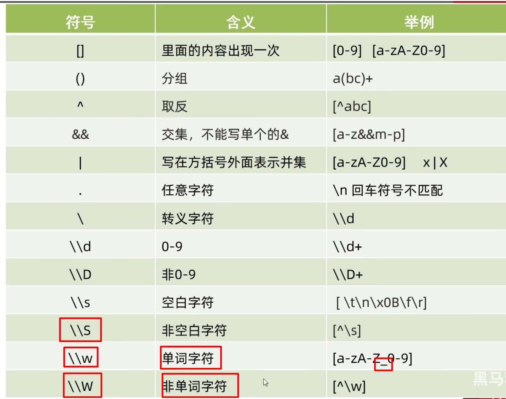
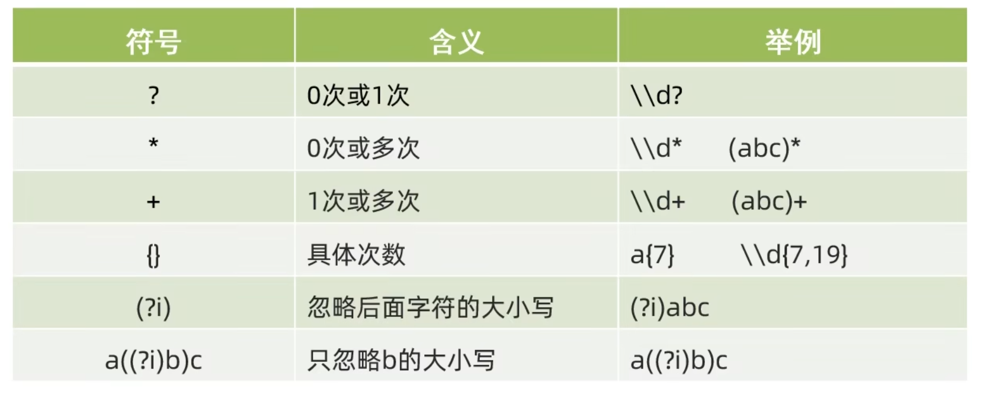

## 正则表达式
正则表达式一般用作字符串的匹配和替换。
下面是正则表达式符号说明：

[grid]


[/grid]

基础的使用方式：

用一个字符串接受正则表达式，然后用matches方法方法判断字符串是否符合正则表达式。

需要注意的是，正则表达式的符号需要转义，否则会报错，比如在用\d时应该用\\d。

在初步用字符串接受正则表达式时，系统只会认为他只是一串字符串，只有后面有matches方法方法时，才会去判断是否符合正则表达式，所以最好是先用matches方法方法判断字符串是否符合正则表达式，再用正则表达式的符号。

另外，idea中有一个正则表达式的生成插件，Any-rule，在实际工作中，我们要掌握怎么用他生成的正则去改成自己需要的就可以了。

```java
 String strPattern1="\\w{4,16}";
        String strPattern2="\\d{17}[\\dXx]";
        String strPattern3="([0-7]\\d|[8][0-2])\\d{4}([1][98]\\d{2}|[2][0]([01]\\d|[2][0-6]))([0][13578]([0][1-9]|[1-2][0-9]|[3][01])|[0][469](0[1-9]|[12][0-9]|[3][0])|[0][2]([0][1-9]|[12][0-9])|[1][1](0[1-9]|[12][0-9]|[3][0])|[1][02]([0][1-9]|[1-2][0-9]|[3][01]))\\d{3}[\\dxX]";

        System.out.println("asda".matches(strPattern1));//true
        System.out.println("12345678901234567x".matches(strPattern2));//true
        System.out.println("82111120261231211x".matches(strPattern3));//true
```