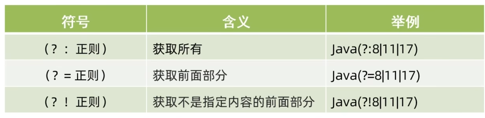

## 正则表达式
正则表达式一般用作字符串的匹配和替换。
下面是正则表达式符号说明：

[grid]


[/grid]

基础的使用方式：

## 方法1

用一个字符串接受正则表达式，然后用matches方法方法判断字符串是否符合正则表达式。

需要注意的是，正则表达式的符号需要转义，否则会报错，比如在用\d时应该用\\d。

在初步用字符串接受正则表达式时，系统只会认为他只是一串字符串，只有后面有matches方法方法时，才会去判断是否符合正则表达式，所以最好是先用matches方法方法判断字符串是否符合正则表达式，再用正则表达式的符号。

另外，idea中有一个正则表达式的生成插件，Any-rule，在实际工作中，我们要掌握怎么用他生成的正则去改成自己需要的就可以了。

```java
 String strPattern1="\\w{4,16}";
        String strPattern2="\\d{17}[\\dXx]";
        String strPattern3="([0-7]\\d|[8][0-2])\\d{4}([1][98]\\d{2}|[2][0]([01]\\d|[2][0-6]))([0][13578]([0][1-9]|[1-2][0-9]|[3][01])|[0][469](0[1-9]|[12][0-9]|[3][0])|[0][2]([0][1-9]|[12][0-9])|[1][1](0[1-9]|[12][0-9]|[3][0])|[1][02]([0][1-9]|[1-2][0-9]|[3][01]))\\d{3}[\\dxX]";

        System.out.println("asda".matches(strPattern1));//true
        System.out.println("12345678901234567x".matches(strPattern2));//true
        System.out.println("82111120261231211x".matches(strPattern3));//true
```

## 方法2
用对象的方式去用，其实这也是更加系统化的使用方式。

首先要认识两个类：Pattern和Matcher。

Pattern类：
Pattern类是编译后的正则表达式，它包含了编译后的正则表达式的匹配信息。

Matcher类：
Matcher类是匹配正则表达式的一个实例，它包含了匹配的字符串信息。

用对象的方式去用，需要先用Pattern.compile方法方法编译正则表达式，然后用matcher方法方法
创建一个Matcher对象，最后用Matcher对象的matches方法方法判断字符串是否符合正则表达式。

```java
Pattern p=Pattern.compile(strPattern1);
Matcher m=p.matcher("asda");
System.out.println(m.matches());//true
```

给一个我写的具体例子：
```java
        Pattern p=Pattern.compile("\\w{4,16}");//这里创建pattern对象，用compile方法传入正则表达式，相当于定义一个正则表达式的对象
        Matcher m=p.matcher("12345678901234567x");//这里创建matcher的对象，意为创建一个比对的对象，用p.matcher(str)的方法来创建这样一个使用p的正则表达式的对str做寻找的对象
        m.find();//这个方法相当于启动一次寻找，Boolean的返回类型，找到了返回true，没找到返回false，并且会记录一次寻找到的字符串的索引
        String f=m.group();//这个方法可以把从find（）方法里找到的索引内容提取出来，返回string类型
        System.out.println(f);//结果1234567890123456
```

而实际使用中，我们不会制作一次寻找，所以可以做一个while循环，把每一次内容都打印出来。
```java
        while(m.find()){
            System.out.println(m.group());
        }
```

实际可用例子
```java
        Pattern p1=Pattern.compile("java\\d{1,2}");
        Matcher m1=p1.matcher("我们使用java1，java8，java11，java17，java21，未来还会有java26等等");
        while(m1.find()){
            System.out.println(m1.group());//结果java1,java8,java11,java17,java21,java26

        }
```

## 有选择的正则(补充)
跟在正常的正则后面用（），分别使用?=,?:,?!形成选择

 **?=**,匹配后不返回后面的内容

 **?:**,匹配后返回后面的内容

 **?!**,排除后面的内容匹配

 
        
```java
//有选择的正则
        //?=,匹配后不返回后面的内容
        //?:,匹配后返回后面的内容
        //?!,排除后面的内容匹配
        String a1="((?i)java)(8|17|11)";//匹配java8,java11,java17
        String a2="((?i)java)(?=8|17|11)";//匹配java8,java11,java17，但是不返回后面的内容
        String a3="((?i)java)(?:8|17|11)";//匹配java8,java11,java17，但是返回后面的内容
        String a4="((?i)java)(?!8|17|11)";//匹配java但后缀除开8,17,11

        Pattern pp=Pattern.compile(a4);
        Matcher m3=pp.matcher("我们使用java1，java8，java11，java17，java21，未来还会有java26等等");
        while(m3.find()){
            System.out.println(m3.group());
        }
```


## 正则的string方法使用（补充）
在String类中，除了有matches方法方法，用于判断字符串是否符合正则表达式。

还有replaceAll方法方法，用于替换字符串中的正则表达式匹配的内容。

以及split方法方法，用于将字符串根据正则表达式进行分割。

### replaceAll方法
replaceAll方法方法用于替换字符串中的正则表达式匹配的内容。
 ```java
 String str="12xyz";
 str=str.replaceAll("\\d","*");
 System.out.println(str);//结果**xyz
 ```
 ### split方法
split方法方法用于将字符串根据正则表达式进行分割，需注意返回的是一个string字符串
 ```java
 String str="12abc34abc56";
 String[] arr=str.split("abc");
 for(String s:arr){
    System.out.println(s);//结果12,34,56
 }
 ```

## 分组（补充）

分组是指在正则表达式中用（）括起来的内容，用于匹配字符串中的子模式。

分组的方式，从左边数左括号“（”，每一个左括号就是一个分组，从1开始编号。但是，像（?i）(?=)(?:)(?!)属于非捕获分组，不会被编号。

而在写正则的时候可以反复使用我们已经分好组的内容。

在正则式内""\\\组号""可以引用分组的内容。在正则式外""$组号""可以引用分组的内容。

```java
String str1="我要学学编编编编程程程程程程程程";
        String b= str1.replaceAll("(.)\\1+","$1");//这里就是对组的使用
        System.out.println(b);
```


 **其实还有许多其他的能用到正则的方法，更多的可以在API帮助文档中查看，具体可以看方法内的形参，只要出现String regex，就可以用正则表达式。**
 